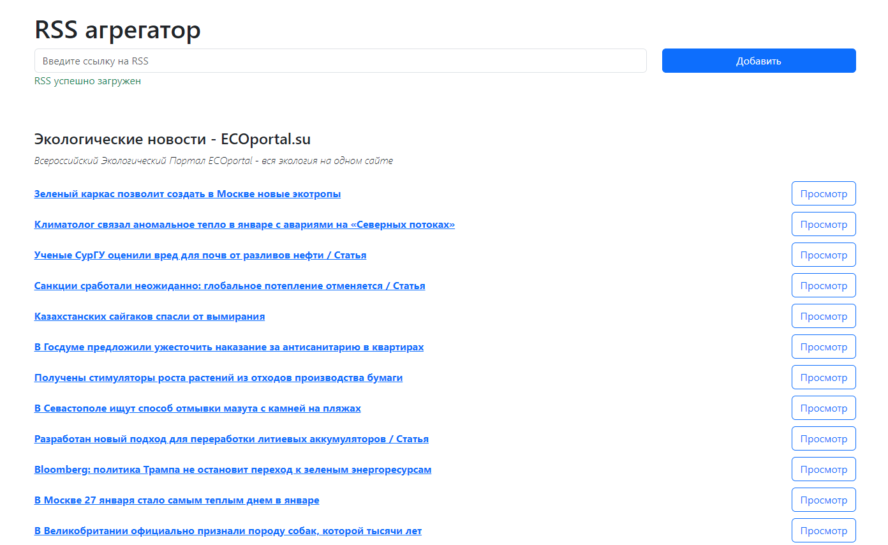

# RSS aggregator

[View the site here](https://frontend-project-11-omega-dusky.vercel.app/)

### Hexlet tests and linter status:

[](https://github.com/KindProgrammer/frontend-project-11/actions)
[](https://codeclimate.com/github/KindProgrammer/frontend-project-11/maintainability)

The service for aggregating RSS feeds, which makes it convenient to read various sources, such as blogs.

#### Installation

You should have Node.js installed before proceeding.

```
$ git clone https://github.com/KindProgrammer/frontend-project-11.git
$ cd frontend-project-11/
$ make install
```

#### Launch

```
$ make develop
```

#### How to use

1. Go to the application website
2. Enter the RSS source link
3. press the button 'add'
4. Enjoy


